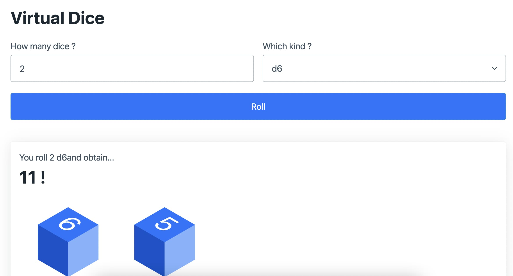

# Virtual Dice

Random Number generator with PHO

## Demo

[Live Demo on heroku](https://php01-virtualdice.herokuapp.com/)

## Description

My first PHP project ever.
This Project is proposed by [codementor.io](https://www.codementor.io/projects)
I just learned OOP so I choose to make a Die Object and a handfulOfDice() function to instanciate that object .

## Made with...

I used CSS framework (PicoCSS ) to quickly get something and Cube.CSS to generate the "virtual dice".

-   [Pico.css](https://picocss.com/) - Framework CSS (front-end)
-   [Cube.CSS](https://github.com/ShimilSAbraham/Cube.CSS) - For the "Virtual Dice"
